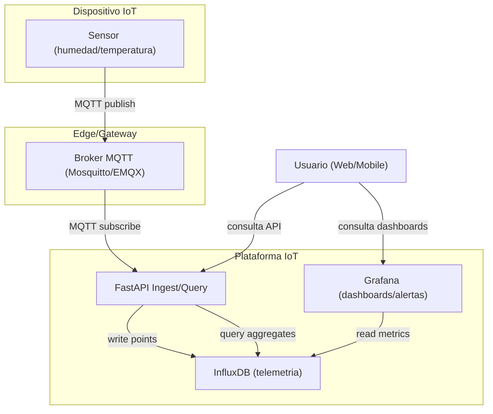

# C4 - IoT Agricultura (Nivel Contenedor)

```mermaid
flowchart TB
  subgraph Device["Dispositivo IoT"]
    Sensor["Sensor (humedad/temperatura)"]
  end

  subgraph Edge["Edge/Gateway"]
    MQTT["Broker MQTT (Mosquitto/EMQX)"]
  end

  subgraph Platform["Plataforma IoT"]
    API["FastAPI Ingest/Query"]
    Influx["InfluxDB (telemetria)"]
    Grafana["Grafana (dashboards/alertas)"]
  end

  User["Usuario (Web/Mobile)"]

  Sensor -->|MQTT publish| MQTT
  MQTT -->|MQTT subscribe| API
  API -->|write points| Influx
  API -->|query aggregates| Influx
  Grafana -->|read metrics| Influx
  User -->|consulta dashboards| Grafana
  User -->|consulta API| API
```
